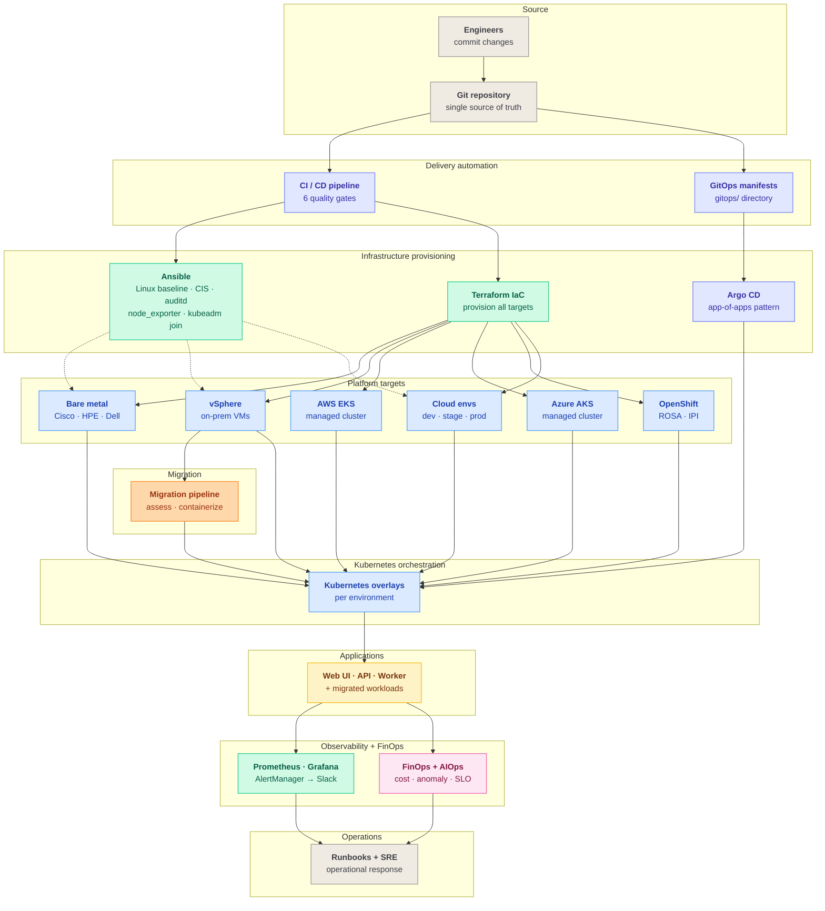

# NAWEX — Naweji Enterprise Excellence Platform

> **Hybrid DevOps, FinOps, SRE, AIOps, and GitOps reference implementation for regulated mission workloads.**

A working reference architecture for delivering, operating, and continuously optimizing mission-critical systems across **bare metal, vSphere, AWS, and Azure** — under one control plane, one set of quality gates, and one observability substrate.

---

## Design Principles

| # | Principle | What it means in this repo |
|---|-----------|----------------------------|
| 1 | **Single control plane, many execution backends** | vSphere, AWS, Azure, OpenShift, and bare metal are peer targets behind one IaC, GitOps, and observability stack. |
| 2 | **Policy and security as code at every gate** | Hadolint, Trivy, tfsec, checkov, kubeconform, and Pod Security Admission run as pipeline gates, not audits. |
| 3 | **Cost is a first-class operational signal** | FinOps telemetry (rightsizing, budget burn, anomaly detection) rides the same alert/incident pipeline as reliability signals. |
| 4 | **Every change is reviewable, reversible, attributable** | GitOps is the contract; manual access to prod is the exception. |

---

## How The Platform Works

The platform is a **layered delivery stack**. Source of truth on top, execution backends in the middle, GitOps binds the two, observability closes the loop.



---

## Platform Summary

This repository shows a mission platform moving from provisioning to delivery to operations, across cloud and on-prem, in one coherent model. It combines **Terraform, Ansible, Kubernetes, Argo CD, Prometheus/Grafana, runbooks, and Python FinOps/AIOps utilities** in a single workflow.

It also demonstrates a **VM-to-Kubernetes migration path** (option 1: containerize). On-prem vSphere VMs are inventoried, rebuilt as containers, and deployed to **EKS**, **AKS**, or **OpenShift** — managed (ROSA on AWS), self-managed IPI on vSphere, or self-managed IPI on **bare metal** (Cisco UCS, HPE ProLiant, Dell PowerEdge) — via GitOps. See [migration/](migration/) and [runbooks/vm-to-k8s-migration.md](runbooks/vm-to-k8s-migration.md).

### Bare-metal OpenShift footprint

For regulated, latency-sensitive, or hardware-attested workloads, NAWEX supports OpenShift on physical servers with no hypervisor, across the three enterprise server families typical of on-prem data centers:

| Vendor | Example platforms                   | BMC     | Redfish virtual-media scheme |
|--------|-------------------------------------|---------|------------------------------|
| Cisco  | UCS C220/C240 M6 (standalone CIMC)  | CIMC    | `redfish-virtualmedia://`    |
| HPE    | ProLiant DL360 / DL380              | iLO 5   | `ilo5-virtualmedia://`       |
| Dell   | PowerEdge R650 / R750               | iDRAC 9 | `idrac-virtualmedia://`      |

Terraform env [infra/terraform/envs/openshift-baremetal/](infra/terraform/envs/openshift-baremetal/) renders a compliant `platform: baremetal` install-config, translating a vendor-agnostic host list into the correct per-vendor Redfish URL. `openshift-install` then drives PXE-less, virtual-media installs over each host's BMC. Ansible inventory [infra/ansible/inventories/baremetal/](infra/ansible/inventories/baremetal/) groups nodes by vendor so the firmware-baseline playbook [infra/ansible/playbooks/baremetal-firmware-baseline.yml](infra/ansible/playbooks/baremetal-firmware-baseline.yml) validates every BMC before install.

---

## Repository Map

| Directory | Purpose |
|-----------|---------|
| [architecture/](architecture/) | Target platform design, architecture views, SLI/SLO model. |
| [app/](app/) | Deployable workloads — [web UI](app/nawex-web-ui/), [API](app/nawex-api/), [worker](app/nawex-worker/). |
| [infra/terraform/](infra/terraform/) | Reusable modules + env compositions: cloud (dev/staging/prod), [on-prem vSphere](infra/terraform/envs/onprem/), [AWS EKS](infra/terraform/envs/aws-eks/), [Azure AKS](infra/terraform/envs/azure-aks/), [ROSA](infra/terraform/envs/openshift-rosa/), [OpenShift vSphere IPI](infra/terraform/envs/openshift-vsphere/), [OpenShift bare-metal IPI](infra/terraform/envs/openshift-baremetal/). |
| [infra/ansible/](infra/ansible/) | Everything Ansible: the mandatory Linux baseline ([system](infra/ansible/roles/system/), [security](infra/ansible/roles/security/), [observability](infra/ansible/roles/observability/), [docker](infra/ansible/roles/docker/)) orchestrated by [playbooks/linux-baseline.yml](infra/ansible/playbooks/linux-baseline.yml); the [BMC firmware preflight](infra/ansible/roles/baremetal-bmc/) for bare metal; per-env inventories ([static](infra/ansible/inventories/onprem/hosts.yml), [dynamic vSphere](infra/ansible/inventories/onprem/vmware.yml), [bare-metal by vendor](infra/ansible/inventories/baremetal/hosts.yml)); no-Ansible fallback scripts ([harden.sh](infra/ansible/scripts/harden.sh), [install_monitoring.sh](infra/ansible/scripts/install_monitoring.sh), [cost_check.sh](infra/ansible/scripts/cost_check.sh)); compliance artifacts ([CIS checklist](infra/ansible/compliance/cis-checklist.md), [audit-rules](infra/ansible/compliance/audit-rules.conf)); and the [baseline rationale](infra/ansible/docs/baseline-explained.md). |
| [k8s/](k8s/) | Base manifests + overlays for [dev](k8s/overlays/dev/), [staging](k8s/overlays/staging/), [prod](k8s/overlays/prod/), [onprem](k8s/overlays/onprem/), [aws-eks](k8s/overlays/aws-eks/), [azure-aks](k8s/overlays/azure-aks/), [openshift](k8s/overlays/openshift/). |
| [migration/](migration/) | VM→container tooling — [assess](migration/assess/), [containerize](migration/containerize/), [samples](migration/samples/). |
| [gitops/](gitops/) | Argo CD layer — [root app](gitops/root-application.yaml), [project](gitops/project.yaml), [env apps](gitops/apps/), [local harness](gitops/local/). |
| [observability/](observability/) | Prometheus, Grafana, [multi-burn-rate SLO alerts](observability/alerts/slo-alerts.yml), [AlertManager → Slack](observability/alertmanager/alertmanager.yml). |
| [finops-aiops/](finops-aiops/) | Python utilities for anomaly detection, rightsizing, budget burn, SLO risk. |
| [runbooks/](runbooks/) | Incident, rollback, K8s troubleshooting, cost response, [Slack alerting](runbooks/slack-alerting.md), [VM→K8s migration](runbooks/vm-to-k8s-migration.md), [OpenShift ops](runbooks/openshift-operations.md). |
| [scripts/](scripts/) | Bootstrap, deploy, smoke-test, incident helpers, per-alert [remediation scripts](scripts/remediations/). |

---

## What This Proves

- Infrastructure as code across **bare metal (Cisco / HPE / Dell), vSphere, AWS, Azure** with reusable Terraform modules.
- A [mandatory Linux baseline](infra/ansible/playbooks/linux-baseline.yml) — `system`, `security`, `observability`, and `docker` Ansible roles, plus no-Ansible fallback scripts, a CIS checklist, and an auditd ruleset — applied uniformly to every host across the hybrid fleet.
- Ansible configuration management with a dynamic vSphere inventory and a vendor-grouped bare-metal inventory with BMC firmware-baseline validation.
- Kubernetes packaging with base + overlay separation across **seven targets** (dev, staging, prod, onprem, aws-eks, azure-aks, openshift).
- GitOps delivery with Argo CD, scoped `AppProject` roles, per-env retry policy.
- Hybrid management across bare-metal, cloud, and on-prem virtualized targets — plus a migration bridge between them.
- **VM-to-K8s migration** (containerize): assess vSphere VMs → generate Dockerfile + manifests → deploy to EKS, AKS, or OpenShift via GitOps.
- Observability, Slack approve/deny incident flow, SRE operating practices.
- FinOps and AIOps automation embedded directly in the platform workflow.

---

## Alerting + Incident Response (Slack)

Engineers get paged in Slack when SLO burn, crashlooping pods, or budget drift trip a rule. Each alert carries a remediation hint and a one-line approve/deny command.

```text
Prometheus rules  ──►  AlertManager  ──►  Slack channel
                             │
                             └─►  alert_webhook.py  ──►  .incidents/<id>.json
                                                                │
                                                                ▼
                                                   scripts/incident_respond.sh
                                                   ├── list
                                                   ├── show    <id>
                                                   ├── approve <id>  → scripts/remediations/<action>.sh
                                                   └── deny    <id>
```

- **Alert rules** live in [observability/alerts/slo-alerts.yml](observability/alerts/slo-alerts.yml). Each rule has a `remediation_action` label that maps 1:1 to a script in [scripts/remediations/](scripts/remediations/).
- **AlertManager** routes via [observability/alertmanager/alertmanager.yml](observability/alertmanager/alertmanager.yml) using `${SLACK_WEBHOOK_URL}`. The Slack message body is rendered from [slack.tmpl](observability/alertmanager/templates/slack.tmpl) and always includes the summary, the runbook URL, and copy-ready `approve` / `deny` / `show` commands.
- **Receiver** — [scripts/alert_webhook.py](scripts/alert_webhook.py) persists each alert to `.incidents/<fingerprint>.json` so engineers can triage offline.
- **Engineer workflow** on Slack page:
  1. `./scripts/incident_respond.sh show <id>` — preview incident + exact plan in `DRY_RUN=1`.
  2. Approve to run the mapped remediation, or deny to ack without action.
  3. Audit trail posts back to Slack when `SLACK_WEBHOOK_URL` is set.

Full procedure, remediation table, and a local end-to-end test live in [runbooks/slack-alerting.md](runbooks/slack-alerting.md).

---

## Security Posture

- Kubernetes namespaces labeled for Pod Security Admission `restricted` enforcement.
- API workload uses a dedicated service account with `automountServiceAccountToken: false`.
- Containers run as non-root with `RuntimeDefault` seccomp, dropped Linux capabilities, `readOnlyRootFilesystem`, no privilege escalation, and a startup / readiness / liveness probe triad.
- `PodDisruptionBudget` + `topologySpreadConstraints` keep the API available during node churn.
- Argo CD project permissions scoped to the resource kinds this platform actually deploys (no wildcards); read-only and ops roles declared in the AppProject.
- Network policy keeps default-deny and adds only the minimum ingress + DNS egress needed.
- CI runs **Hadolint** on every Dockerfile, **Trivy** against each built image (CRITICAL/HIGH gate), **kubeconform** against every overlay, **tfsec** + **checkov** on Terraform, **ruff** + **pytest** on Python, **shellcheck** on every script.
- Web UI HTML ships a strict CSP and related headers; API Docker image is a distroless-style multi-stage build served by gunicorn with a container HEALTHCHECK.

---

## CI/CD — GitHub Actions and GitLab CI/CD

The platform ships **two interchangeable CI/CD implementations** so the same quality gates run on whichever SCM a team standardizes on. Both pipelines execute the same six-stage quality gate (lint → security → test → validate → build → deploy) and both hand off to Argo CD for cluster reconciliation.

| Stage | GitHub Actions ([.github/workflows/](.github/workflows/)) | GitLab CI/CD ([.gitlab-ci.yml](.gitlab-ci.yml)) | Tools |
| ----- | --------------------------------------------------------- | ----------------------------------------------- | ----- |
| lint | `ci.yml` → `python`, `shell` | `python:lint`, `shellcheck`, `terraform:fmt`, `hadolint` | ruff, shellcheck, terraform fmt, hadolint |
| security | `ci.yml` → `docker` (Trivy), `terraform.yml` → `tfsec`, `checkov` | `tfsec`, `checkov`, `trivy:image` | tfsec, checkov, trivy |
| test | `ci.yml` → `python` (pytest) | `pytest` | pytest + pytest-cov |
| validate | `ci.yml` → `kustomize`, `gitops`; `terraform.yml` → `validate` | `terraform:validate` (matrix × 9 envs), `kubeconform`, `gitops:manifests` | kubeconform, terraform validate/plan |
| build | `ci.yml` → `docker` (matrix × 3 images) | `docker:build` (matrix × 3 images → `$CI_REGISTRY_IMAGE`) | docker buildx |
| deploy | `deploy.yml` (workflow_dispatch, 7 envs) | `deploy:*` (manual, 7 envs, GitLab environments) | kustomize render + GitOps hand-off |
| schedule | `finops-sre.yml` (cron `0 12 * * 1`) | `finops-sre` (GitLab pipeline schedule, `RUN_FINOPS=1`) | rightsizing, budget burn, SLO risk, anomaly detection |

### Running the GitLab pipeline

1. **Import the repo** into a GitLab project (or push to a GitLab remote). GitLab auto-detects [.gitlab-ci.yml](.gitlab-ci.yml).
2. **Configure CI/CD variables** in *Settings → CI/CD → Variables*: `SLACK_WEBHOOK_URL` (optional, masked), and cloud credentials (`AWS_*`, `ARM_*`) for `terraform plan` against real cloud envs.
3. **Container registry** — `docker:build` pushes to `$CI_REGISTRY_IMAGE/<image>:<short-sha>` on `main` using the built-in `$CI_REGISTRY_USER` / `$CI_REGISTRY_PASSWORD` tokens.
4. **Weekly FinOps job** — create a pipeline schedule (*CI/CD → Schedules*) with cron `0 12 * * 1` and variable `RUN_FINOPS=1`. Reports are uploaded as job artifacts and posted to Slack when `SLACK_WEBHOOK_URL` is set.
5. **Production deploys** — `deploy:prod` is `when: manual` and scoped to the `prod` GitLab environment, matching the GitHub `workflow_dispatch` gate and Argo CD's `automated: false` stance for prod.

Both pipelines validate the same Terraform envs (dev, staging, prod, onprem, aws-eks, azure-aks, openshift-rosa, openshift-vsphere, openshift-baremetal) and the same seven Kustomize overlays, so SCM choice is a **deployment detail**, not an architectural commitment.

---

## GitOps Flow

1. Platform changes land in Git and are validated by local or CI automation.
2. Infrastructure and host baseline changes flow through Terraform and Ansible.
3. Argo CD reads [gitops/root-application.yaml](gitops/root-application.yaml) and syncs the child applications from [gitops/apps/](gitops/apps/).
4. Each GitOps application points to a Kubernetes environment overlay under [k8s/overlays/](k8s/overlays/), including the [on-prem deployment path](k8s/overlays/onprem/).
5. Runtime telemetry flows into [observability/](observability/) and can be acted on with [runbooks/](runbooks/) and [finops-aiops/](finops-aiops/).

---

## Local Argo CD Test

Use the local harness to validate the GitOps flow on your workstation without touching the main Argo CD application set.

1. Run `./scripts/start_local_gitops.sh`.
2. Port-forward Argo CD — `kubectl port-forward svc/argocd-server -n argocd 8080:443`.
3. Port-forward the sample workload — `kubectl port-forward svc/nawex-api -n nawex-local 8081:80`.
4. Validate the deployment — `./scripts/smoke_test.sh`.
5. Tear down — `./scripts/stop_local_gitops.sh`.

The harness creates a `kind` cluster from [test/kind/argocd-kind.yaml](test/kind/argocd-kind.yaml), builds the API image from [app/nawex-api/](app/nawex-api/) as `nawex-api:local`, snapshots the workspace into a local bare Git repo so Argo CD can reconcile uncommitted changes, installs Argo CD, applies [gitops/local/root-application.yaml](gitops/local/root-application.yaml) which syncs [gitops/local/apps/local-platform.yaml](gitops/local/apps/local-platform.yaml), and deploys [k8s/overlays/local/](k8s/overlays/local/) into the `nawex-local` namespace.

---

## Development

```bash
# Optional: install pre-commit hooks (ruff, terraform fmt, shellcheck, hadolint, ...)
pip install pre-commit && pre-commit install

# Python lint + tests (same as CI)
pip install ruff pytest -r app/nawex-api/requirements.txt -r finops-aiops/python/requirements.txt
ruff check . && ruff format --check . && pytest -q

# Validate every Kustomize overlay
for o in k8s/overlays/*; do kustomize build "$o" >/dev/null; done

# Copy the env file and fill in SLACK_WEBHOOK_URL etc.
cp .env.example .env
```

---

## About the Author

**Emmanuel Naweji** is a platform engineer and applied AI researcher whose work sits at the intersection of large-scale distributed systems and trustworthy machine intelligence in regulated domains.

- **Industry experience.** Platform, cloud, and reliability engineering for global enterprises including **IBM**, **Comcast**, and other Fortune-class organizations — environments where production posture spans regulated workloads, multi-region footprints, and multi-million-dollar cloud budgets.
- **Research.** PhD researcher focused on **AI / ML / Robotics applied to highly regulated environments** — safety-critical, audit-bound, human-in-the-loop systems. Research interests span MLOps and LLMOps for regulated workloads, autonomy under formal constraints, model governance, and the operational substrate (observability, lineage, drift detection) required to deploy learning systems where compliance and reliability are equally non-negotiable.
- **Engineering practice.** Hybrid cloud (AWS, Azure, GCP, OpenShift, vSphere), Kubernetes platform engineering, GitOps, FinOps, SRE, AIOps. Comfortable from the kernel up to the model-serving layer, and from a single Terraform module to a multi-cluster app-of-apps topology.
- **Operating philosophy.** Build platforms that compound: every change reviewable, every cost attributable, every alert actionable, every model auditable. This repository is one expression of that philosophy.

NAWEX is the reference implementation that captures these patterns in a form others can read, run, and adapt.

---

## Notes

- Replace the placeholder GitHub repository URL in the files under [gitops/](gitops/) before using Argo CD.
- The environment overlays target separate namespaces for safer side-by-side syncs; real deployments may still separate environments further by cluster or account boundary.
- The local GitOps harness defaults `LOCAL_GIT_HOST` to `host.docker.internal`, which works well on Docker Desktop. Override it if your local container runtime exposes the host differently.
- The hybrid model includes an [on-prem Argo CD application](gitops/apps/onprem-platform.yaml), an [on-prem Kubernetes overlay](k8s/overlays/onprem/), and supporting [Terraform](infra/terraform/envs/onprem/) and [Ansible inventory](infra/ansible/inventories/onprem/) definitions.
- Prod's Argo CD application intentionally runs with `automated: false` for `prune` and `selfHeal` — prod changes require an explicit sync gate. Dev, staging, and onprem are fully automated.
