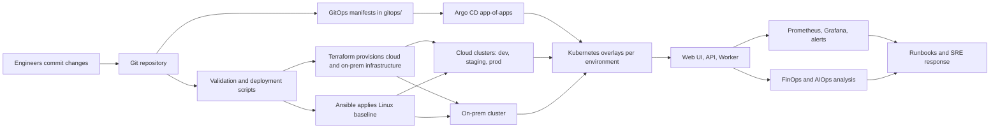

# nawex-hybrid-devops-platform

Enterprise hybrid DevOps, FinOps, SRE, AIOps, and GitOps reference implementation for a fictional regulated mission data platform.

## Platform Summary

This repository shows how a mission platform moves from infrastructure provisioning to application delivery and then into operations across both cloud and on-prem environments. It combines Terraform, Ansible, Kubernetes, Argo CD, observability, runbooks, and Python-based FinOps and AIOps utilities in one delivery model.

## How The Platform Works

## Domain Map

- [architecture/](architecture/) documents the target platform design, architecture views, and SLI/SLO model.
- [app/](app/) contains the deployable workloads: [web UI](app/nawex-web-ui/), [API](app/nawex-api/), and [worker](app/nawex-worker/).
- [infra/terraform/](infra/terraform/) defines reusable infrastructure modules and environment compositions for cloud environments plus the [on-prem environment](infra/terraform/envs/onprem/).
- [infra/ansible/](infra/ansible/) holds Linux baseline automation, shared roles, and per-environment inventories including [on-prem nodes](infra/ansible/inventories/onprem/).
- [k8s/](k8s/) contains the Kubernetes base manifests and the [dev](k8s/overlays/dev/), [staging](k8s/overlays/staging/), [prod](k8s/overlays/prod/), and [onprem](k8s/overlays/onprem/) overlays.
- [gitops/](gitops/) contains the Argo CD GitOps layer, including the [root application](gitops/root-application.yaml), [project](gitops/project.yaml), the [environment apps](gitops/apps/), and the [local test harness](gitops/local/).
- [observability/](observability/) contains Prometheus configuration, Grafana dashboards, and alert definitions.
- [finops-aiops/](finops-aiops/) contains Python utilities for anomaly detection, rightsizing, budget burn prediction, and SLO risk analysis.
- [runbooks/](runbooks/) contains operational procedures for incidents, rollback, Kubernetes troubleshooting, and cost response.
- [scripts/](scripts/) contains bootstrap, deployment, and smoke-test helpers used around the platform lifecycle.

## What This Proves

- Infrastructure as code with reusable Terraform modules
- Configuration management with Ansible
- Kubernetes packaging with base and overlay separation
- GitOps delivery with Argo CD application manifests
- Hybrid environment management across cloud and on-prem targets
- Observability, alerting, and SRE operating practices
- FinOps and AIOps automation embedded into the platform workflow

## Security Posture

- Kubernetes namespaces are labeled for Pod Security Admission `restricted` enforcement.
- The API workload uses a dedicated service account with `automountServiceAccountToken: false`.
- Containers run as non-root with `RuntimeDefault` seccomp, dropped Linux capabilities, and no privilege escalation.
- Argo CD project permissions are scoped to the resource kinds this platform actually deploys instead of wildcard access.
- Network policy keeps the default deny stance and adds only the minimum ingress and DNS egress needed for the sample service.

## GitOps Flow

1. Platform changes land in Git and are validated by local or CI automation.
2. Infrastructure and host baseline changes are managed through Terraform and Ansible.
3. Argo CD reads [gitops/root-application.yaml](gitops/root-application.yaml) and syncs the child applications from [gitops/apps/](gitops/apps/).
4. Each GitOps application points to a Kubernetes environment overlay under [k8s/overlays/](k8s/overlays/), including the [on-prem deployment path](k8s/overlays/onprem/).
5. Runtime telemetry flows into [observability/](observability/) and can be acted on with [runbooks/](runbooks/) and [finops-aiops/](finops-aiops/).

## Local Argo CD Test

Use the local harness when you want to validate the GitOps flow on your workstation without changing the main Argo CD application set.

1. Run `./scripts/start_local_gitops.sh`.
2. Port-forward Argo CD with `kubectl port-forward svc/argocd-server -n argocd 8080:443`.
3. Port-forward the sample workload with `kubectl port-forward svc/nawex-api -n nawex-local 8081:80`.
4. Validate the deployment with `./scripts/smoke_test.sh`.
5. Tear everything down with `./scripts/stop_local_gitops.sh`.

What the local harness does:

- Creates a `kind` cluster from [test/kind/argocd-kind.yaml](test/kind/argocd-kind.yaml).
- Builds the API image from [app/nawex-api/](app/nawex-api/) and loads it into the cluster as `nawex-api:local`.
- Snapshots the current workspace into a local bare Git repository so Argo CD can reconcile even uncommitted changes.
- Installs Argo CD and applies [gitops/local/root-application.yaml](gitops/local/root-application.yaml), which syncs [gitops/local/apps/local-platform.yaml](gitops/local/apps/local-platform.yaml).
- Deploys the local Kubernetes overlay from [k8s/overlays/local/](k8s/overlays/local/) into the `nawex-local` namespace.

## Notes

- Replace the placeholder GitHub repository URL in the files under [gitops/](gitops/) before using Argo CD.
- The environment overlays now target separate namespaces for safer side-by-side syncs; real deployments may still separate environments further by cluster or account boundary.
- The local GitOps harness defaults `LOCAL_GIT_HOST` to `host.docker.internal`, which works well on Docker Desktop. Override it if your local container runtime exposes the host differently.
- The hybrid model now includes an [on-prem Argo CD application](gitops/apps/onprem-platform.yaml), an [on-prem Kubernetes overlay](k8s/overlays/onprem/), and supporting [Terraform](infra/terraform/envs/onprem/) and [Ansible inventory](infra/ansible/inventories/onprem/) definitions.
