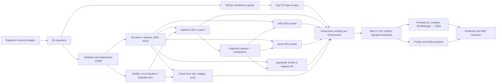

# nawex-hybrid-devops-platform

Enterprise hybrid DevOps, FinOps, SRE, AIOps, and GitOps reference implementation for a regulated mission data platform.

## What NAWEX Means

**NAWEX — Naweji Enterprise Excellence Platform.** A reference architecture and working implementation for delivering, operating, and continuously optimizing mission-critical workloads across hybrid (on-premises + multi-cloud) infrastructure. The platform is designed for environments where reliability, auditability, security posture, and unit economics are non-negotiable — not aspirational.

The design rests on four principles:

1. **Single control plane, many execution backends.** vSphere, AWS, Azure, and OpenShift are peer targets behind one IaC, GitOps, and observability stack — not separate stacks bolted together.
2. **Policy and security as code at every gate.** Static analysis, image scanning, schema validation, and Pod Security Admission are pipeline gates, not afterthoughts.
3. **Cost is a first-class operational signal.** FinOps telemetry (rightsizing, budget burn, anomaly detection) flows through the same alerting and incident-response pipeline as reliability signals.
4. **Every change is reviewable, reversible, and attributable.** GitOps is the contract; manual access to production is the exception, not the workflow.

## Platform Summary

This repository shows how a mission platform moves from infrastructure provisioning to application delivery and then into operations across both cloud and on-prem environments. It combines Terraform, Ansible, Kubernetes, Argo CD, observability, runbooks, and Python-based FinOps and AIOps utilities in one delivery model.

It also demonstrates a **VM-to-Kubernetes migration path** (option 1: containerize): on-prem vSphere VMs are inventoried, rebuilt as containers, and deployed to **EKS (AWS)**, **AKS (Azure)**, or **OpenShift** (ROSA on AWS, or self-managed IPI on vSphere) via GitOps. See [migration/](migration/) and [runbooks/vm-to-k8s-migration.md](runbooks/vm-to-k8s-migration.md).

## How The Platform Works



## Domain Map

- [architecture/](architecture/) documents the target platform design, architecture views, and SLI/SLO model.
- [app/](app/) contains the deployable workloads: [web UI](app/nawex-web-ui/), [API](app/nawex-api/), and [worker](app/nawex-worker/).
- [infra/terraform/](infra/terraform/) defines reusable infrastructure modules and environment compositions: cloud envs (dev, staging, prod), the [on-prem vSphere environment](infra/terraform/envs/onprem/) (uses the [nawex-vsphere module](infra/terraform/modules/nawex-vsphere/)), migration target clusters [AWS EKS](infra/terraform/envs/aws-eks/) and [Azure AKS](infra/terraform/envs/azure-aks/), and OpenShift targets [ROSA](infra/terraform/envs/openshift-rosa/) (managed on AWS) and [self-managed IPI on vSphere](infra/terraform/envs/openshift-vsphere/).
- [infra/ansible/](infra/ansible/) holds Linux baseline automation, shared roles, and per-environment inventories. On-prem supports a [static host list](infra/ansible/inventories/onprem/hosts.yml), a [dynamic vSphere inventory](infra/ansible/inventories/onprem/vmware.yml), and a [kubeadm-join playbook](infra/ansible/playbooks/vsphere-join-cluster.yml).
- [k8s/](k8s/) contains the Kubernetes base manifests and overlays for [dev](k8s/overlays/dev/), [staging](k8s/overlays/staging/), [prod](k8s/overlays/prod/), [onprem](k8s/overlays/onprem/), [aws-eks](k8s/overlays/aws-eks/), [azure-aks](k8s/overlays/azure-aks/), and [openshift](k8s/overlays/openshift/) (ships a `Route`, an SCC RoleBinding for non-root pods, and PSA-restricted namespace labels).
- [migration/](migration/) contains the VM-to-container migration tooling: [assess](migration/assess/) (inventory vCenter VMs → WorkloadProfile stubs), [containerize](migration/containerize/) (WorkloadProfile → Dockerfile + K8s manifest), and [samples](migration/samples/).
- [gitops/](gitops/) contains the Argo CD GitOps layer, including the [root application](gitops/root-application.yaml), [project](gitops/project.yaml), the [environment apps](gitops/apps/), and the [local test harness](gitops/local/).
- [observability/](observability/) contains Prometheus configuration, Grafana dashboards, [multi-burn-rate SLO alerts](observability/alerts/slo-alerts.yml), and an [AlertManager → Slack](observability/alertmanager/alertmanager.yml) pipeline.
- [finops-aiops/](finops-aiops/) contains Python utilities for anomaly detection, rightsizing, budget burn prediction, and SLO risk analysis.
- [runbooks/](runbooks/) contains operational procedures for incidents, rollback, Kubernetes troubleshooting, cost response, the [Slack alerting flow](runbooks/slack-alerting.md), [VM→K8s migration](runbooks/vm-to-k8s-migration.md), and [OpenShift-specific operations](runbooks/openshift-operations.md).
- [scripts/](scripts/) contains bootstrap, deployment, smoke-test, and incident-response helpers, plus per-alert [remediation scripts](scripts/remediations/).

## What This Proves

- Infrastructure as code with reusable Terraform modules across **vSphere, AWS, and Azure**
- Configuration management with Ansible, including a dynamic vSphere inventory
- Kubernetes packaging with base + overlay separation across **seven targets** (dev, staging, prod, onprem, aws-eks, azure-aks, openshift)
- GitOps delivery with Argo CD application manifests, scoped `AppProject` roles, per-env retry policy
- Hybrid environment management across cloud and on-prem targets, plus a migration bridge between them
- **VM-to-K8s migration (option 1 — containerize):** assess vSphere VMs → generate Dockerfile + manifests → deploy to EKS, AKS, or OpenShift (with Route + SCC binding) via GitOps
- Observability, alerting with Slack approve/deny flow, and SRE operating practices
- FinOps and AIOps automation embedded into the platform workflow

## Alerting + Incident Response (Slack)

Engineers get paged in Slack when SLO burn, crashlooping pods, or budget drift trip
a rule. Each alert carries a remediation hint and a one-line approve/deny command.

```text
Prometheus rules  ──►  AlertManager  ──►  Slack channel
                             │
                             └─►  alert_webhook.py  ──►  .incidents/<id>.json
                                                                │
                                                                ▼
                                                   scripts/incident_respond.sh
                                                   ├── list
                                                   ├── show    <id>
                                                   ├── approve <id>  → scripts/remediations/<action>.sh
                                                   └── deny    <id>
```

- **Alert rules** live in [observability/alerts/slo-alerts.yml](observability/alerts/slo-alerts.yml). Each rule has a `remediation_action` label that maps 1:1 to a script in [scripts/remediations/](scripts/remediations/).
- **AlertManager** routes via [observability/alertmanager/alertmanager.yml](observability/alertmanager/alertmanager.yml) using `${SLACK_WEBHOOK_URL}`. The Slack message body is rendered from [slack.tmpl](observability/alertmanager/templates/slack.tmpl) and always includes the summary, the runbook URL, and copy-ready `approve` / `deny` / `show` commands.
- **Receiver**: [scripts/alert_webhook.py](scripts/alert_webhook.py) persists each alert to `.incidents/<fingerprint>.json` so engineers can triage offline.
- **Engineer workflow** (on-call receives Slack ping):
  1. `./scripts/incident_respond.sh show <id>` — preview the incident and the exact plan in `DRY_RUN=1`.
  2. Approve to run the mapped remediation, or deny to acknowledge without action.
  3. Audit trail posts back to Slack if `SLACK_WEBHOOK_URL` is set.

Full procedure, remediation table, and a local end-to-end test live in [runbooks/slack-alerting.md](runbooks/slack-alerting.md).

## Security Posture

- Kubernetes namespaces are labeled for Pod Security Admission `restricted` enforcement.
- The API workload uses a dedicated service account with `automountServiceAccountToken: false`.
- Containers run as non-root with `RuntimeDefault` seccomp, dropped Linux capabilities, `readOnlyRootFilesystem`, no privilege escalation, and a startup/readiness/liveness probe triad.
- A `PodDisruptionBudget` and `topologySpreadConstraints` keep the API available during node churn.
- Argo CD project permissions are scoped to the resource kinds this platform actually deploys (no wildcards), with read-only and ops roles declared in the AppProject.
- Network policy keeps the default-deny stance and adds only the minimum ingress and DNS egress needed for the sample service.
- CI runs **Hadolint** on every Dockerfile, **Trivy** against each built image (CRITICAL/HIGH gate), **kubeconform** against every overlay, **tfsec** + **checkov** on Terraform, **ruff** + **pytest** on Python, and **shellcheck** on all scripts.
- Web UI HTML ships a strict CSP and related headers; API Docker image is a distroless-style multi-stage build served by gunicorn with a container HEALTHCHECK.

## GitOps Flow

1. Platform changes land in Git and are validated by local or CI automation.
2. Infrastructure and host baseline changes are managed through Terraform and Ansible.
3. Argo CD reads [gitops/root-application.yaml](gitops/root-application.yaml) and syncs the child applications from [gitops/apps/](gitops/apps/).
4. Each GitOps application points to a Kubernetes environment overlay under [k8s/overlays/](k8s/overlays/), including the [on-prem deployment path](k8s/overlays/onprem/).
5. Runtime telemetry flows into [observability/](observability/) and can be acted on with [runbooks/](runbooks/) and [finops-aiops/](finops-aiops/).

## Local Argo CD Test

Use the local harness when you want to validate the GitOps flow on your workstation without changing the main Argo CD application set.

1. Run `./scripts/start_local_gitops.sh`.
2. Port-forward Argo CD with `kubectl port-forward svc/argocd-server -n argocd 8080:443`.
3. Port-forward the sample workload with `kubectl port-forward svc/nawex-api -n nawex-local 8081:80`.
4. Validate the deployment with `./scripts/smoke_test.sh`.
5. Tear everything down with `./scripts/stop_local_gitops.sh`.

What the local harness does:

- Creates a `kind` cluster from [test/kind/argocd-kind.yaml](test/kind/argocd-kind.yaml).
- Builds the API image from [app/nawex-api/](app/nawex-api/) and loads it into the cluster as `nawex-api:local`.
- Snapshots the current workspace into a local bare Git repository so Argo CD can reconcile even uncommitted changes.
- Installs Argo CD and applies [gitops/local/root-application.yaml](gitops/local/root-application.yaml), which syncs [gitops/local/apps/local-platform.yaml](gitops/local/apps/local-platform.yaml).
- Deploys the local Kubernetes overlay from [k8s/overlays/local/](k8s/overlays/local/) into the `nawex-local` namespace.

## Development

```bash
# Optional: install pre-commit hooks (ruff, terraform fmt, shellcheck, hadolint, ...)
pip install pre-commit && pre-commit install

# Python lint + tests (same as CI)
pip install ruff pytest -r app/nawex-api/requirements.txt -r finops-aiops/python/requirements.txt
ruff check . && ruff format --check . && pytest -q

# Validate every Kustomize overlay
for o in k8s/overlays/*; do kustomize build "$o" >/dev/null; done

# Copy the env file and fill in SLACK_WEBHOOK_URL etc.
cp .env.example .env
```

## About the Author

**Emmanuel Naweji** is a platform engineer and applied AI researcher whose work sits at the intersection of large-scale distributed systems and trustworthy machine intelligence in regulated domains.

- **Industry experience.** Delivered platform, cloud, and reliability engineering for global enterprises including **IBM**, **Comcast**, and other Fortune-class organizations — environments where production posture spans regulated workloads, multi-region footprints, and multi-million-dollar cloud budgets.
- **Research.** PhD researcher focused on **AI / ML / Robotics applied to highly regulated environments** — including safety-critical, audit-bound, and human-in-the-loop systems. Research interests span MLOps and LLMOps for regulated workloads, autonomy under formal constraints, model governance, and the operational substrate (observability, lineage, drift detection) required to deploy learning systems where compliance and reliability are equally non-negotiable.
- **Engineering practice.** Hybrid cloud (AWS, Azure, GCP, OpenShift, vSphere), Kubernetes platform engineering, GitOps, FinOps, SRE, and AIOps. Comfortable from the kernel up to the model-serving layer, and from a single Terraform module to a multi-cluster app-of-apps topology.
- **Operating philosophy.** Build platforms that compound: every change reviewable, every cost attributable, every alert actionable, every model auditable. This repository is one expression of that philosophy.

NAWEX is the reference implementation that captures these patterns in a form others can read, run, and adapt.

## Notes

- Replace the placeholder GitHub repository URL in the files under [gitops/](gitops/) before using Argo CD.
- The environment overlays target separate namespaces for safer side-by-side syncs; real deployments may still separate environments further by cluster or account boundary.
- The local GitOps harness defaults `LOCAL_GIT_HOST` to `host.docker.internal`, which works well on Docker Desktop. Override it if your local container runtime exposes the host differently.
- The hybrid model includes an [on-prem Argo CD application](gitops/apps/onprem-platform.yaml), an [on-prem Kubernetes overlay](k8s/overlays/onprem/), and supporting [Terraform](infra/terraform/envs/onprem/) and [Ansible inventory](infra/ansible/inventories/onprem/) definitions.
- Prod's Argo CD application intentionally runs with `automated: false` for `prune` and `selfHeal` — prod changes require an explicit sync gate. Dev, staging, and onprem are fully automated.
