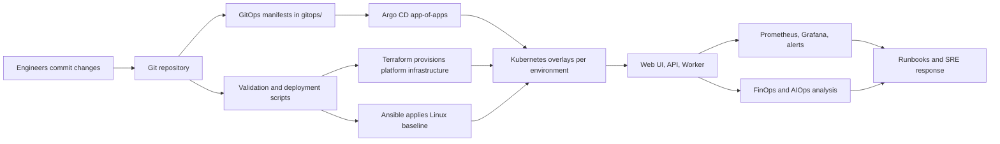

# nawex-hybrid-devops-platform

Enterprise hybrid DevOps, FinOps, SRE, AIOps, and GitOps reference implementation for a fictional regulated mission data platform.

## Platform Summary

This repository shows how a mission platform moves from infrastructure provisioning to application delivery and then into operations. It combines Terraform, Ansible, Kubernetes, Argo CD, observability, runbooks, and Python-based FinOps and AIOps utilities in one delivery model.

## How The Platform Works

## Domain Map

- [architecture/](architecture/) documents the target platform design, architecture views, and SLI/SLO model.
- [app/](app/) contains the deployable workloads: [web UI](app/nawex-web-ui/), [API](app/nawex-api/), and [worker](app/nawex-worker/).
- [infra/terraform/](infra/terraform/) defines reusable infrastructure modules and environment compositions for `dev`, `staging`, and `prod`.
- [infra/ansible/](infra/ansible/) holds Linux baseline automation, shared roles, and per-environment inventories.
- [k8s/](k8s/) contains the Kubernetes base manifests and the [dev](k8s/overlays/dev/), [staging](k8s/overlays/staging/), and [prod](k8s/overlays/prod/) overlays.
- [gitops/](gitops/) contains the Argo CD GitOps layer, including the [root application](gitops/root-application.yaml), [project](gitops/project.yaml), and [environment apps](gitops/apps/).
- [observability/](observability/) contains Prometheus configuration, Grafana dashboards, and alert definitions.
- [finops-aiops/](finops-aiops/) contains Python utilities for anomaly detection, rightsizing, budget burn prediction, and SLO risk analysis.
- [runbooks/](runbooks/) contains operational procedures for incidents, rollback, Kubernetes troubleshooting, and cost response.
- [scripts/](scripts/) contains bootstrap, deployment, and smoke-test helpers used around the platform lifecycle.

## What This Proves

- Infrastructure as code with reusable Terraform modules
- Configuration management with Ansible
- Kubernetes packaging with base and overlay separation
- GitOps delivery with Argo CD application manifests
- Observability, alerting, and SRE operating practices
- FinOps and AIOps automation embedded into the platform workflow

## GitOps Flow

1. Platform changes land in Git and are validated by local or CI automation.
2. Infrastructure and host baseline changes are managed through Terraform and Ansible.
3. Argo CD reads [gitops/root-application.yaml](gitops/root-application.yaml) and syncs the child applications from [gitops/apps/](gitops/apps/).
4. Each GitOps application points to a Kubernetes environment overlay under [k8s/overlays/](k8s/overlays/).
5. Runtime telemetry flows into [observability/](observability/) and can be acted on with [runbooks/](runbooks/) and [finops-aiops/](finops-aiops/).

## Notes

- Replace the placeholder GitHub repository URL in the files under [gitops/](gitops/) before using Argo CD.
- The sample overlays use a shared namespace for simplicity; real deployments typically separate environments by cluster, namespace, or both.
